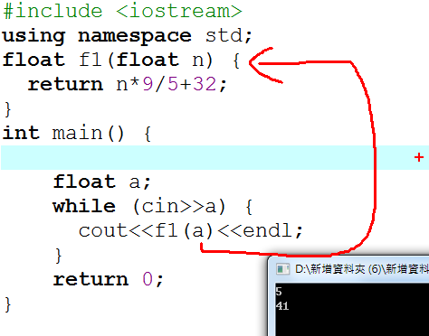
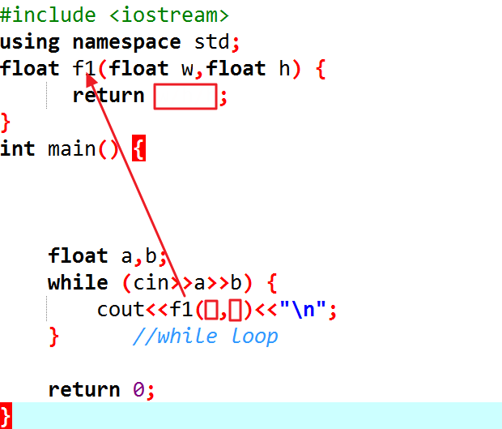

**函數**

**內容 ：**

傳回值型態 函數名稱(型態 參數1, 型態 參數2, \....)

{

// 變數宣告

// 程式碼

return 傳回值;

}

其中 return 語法的功能是讓函數把一個值傳回給呼叫它的程式，也就是說如果函數執行到這一行，後面的程式碼就不會再執行了。

上例我們自訂了一個函式f1，並傳入一個參數a給n，f1計算後傳回return
n\*9/5+32;

請仿照上例，寫一個BMI計算程式。

身高體重指數（又稱身體質量指數，英文為Body Mass
Index，簡稱BMI）是一個計算值，主要用於統計用途。

「身高體重指數」這個概念，是由19世紀中期的比利時通才凱特勒（Lambert
Adolphe Jacques Quetelet）最先提出。它的定義如下：

w = 體重，單位：千克;

h = 身高，單位：米;

BMI = 身高體重指數，單位：千克/平方米

**輸入說明 ：**

男性的身高及體重

**輸出說明 ：**

BMI數值

**範例輸入
：**

60 1.55

73 1.62

**範例輸出 ：**

24.974

27.8159

